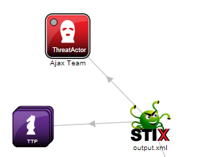
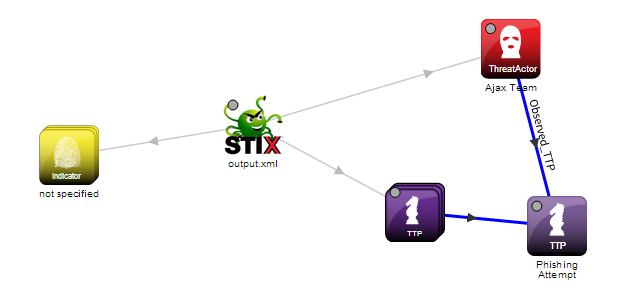

## Background
Read the [FireEye report](report) on malicious actors from Iran targeting governments and commercial computers.

The [STIX version of this report](output.xml) includes the same information in a structured format.

## Getting context

The **Threat Actor** is identified as Ajax Team, who appear to be based in Iran. Their activities point to medium **Sophistication** based on the use of customized malware implants and control infrastructure.

Distribution is unlimited since the **STIX Header** includes no TLP or sensitivity restrictions. 

Information comes directly from a trusted vendor, so we have high **Confidence** in the accuracy of the report.

Since victims were anonymized, there are no historical **Incident** details, but rather individual **Indicators** used for proactive detection.

## Understanding the content

Three indicators are included in the report, to capture each resource used by the actor.

The **Email Indicator** suggests that invite@aeroconf2014.org should be blocked unconditionally, as the sending domain is owned by the malicious actors.
"IEEE Aerospace Conference 2014" is a suspicious subject line seen in those emails, but may also include legitimate emails.

Under the **File Indicator** a malware sample named 'IntelRS.exe' has been seen with several hashes, which can be directly added to a blacklist.

The malware's installation **filepath** is fairly unique, and can be used as a trigger for generic detection as well.

Domains are owned by the malicious actors, and linked to the IP addresses resolved at the time of analysis, which appear to be hosted on an overseas provider. Firewall blocks and DNS filters can be used to prevent access to those without much issue.

The actor sends phishing emails to unsuspecting victims, a behavior captured under **Observed TTP**, which is given a **Relationship** to each malware sample and control server included in the report. 

In order to re-use the **TTP* in other contexts, it acts as a stand-alone object linked to the **Actor** 

## Sharing with others
Say you find an instance of the malware in the course of investigations, a **Sighting** can be created with the control domain and binary hash. This would be created with an appropriate **Confidence** level and linked it to the **ID value** of the overall malware family.

Methods to detect this **Threat Actor**'s activity can be added under a **Course of Action** entry. A YARA signature, updated software patch or network blocklist may also be included.

